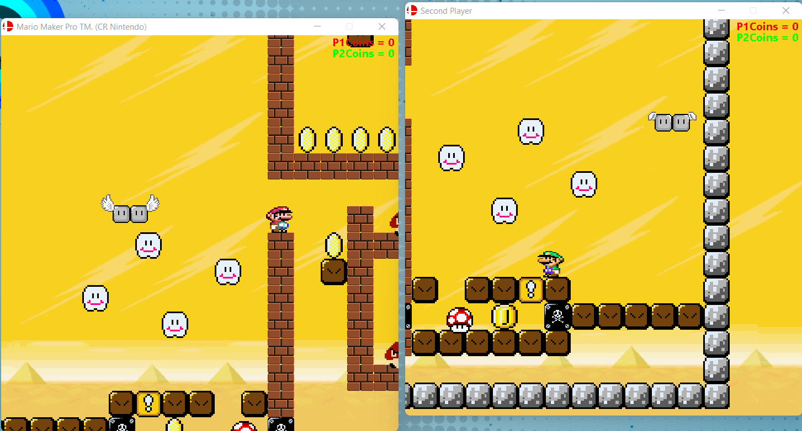

# PA3 - Mario Maker (JAVA)

Semester Project for the Advanced Programming Course (CIIC 4010) - Spring 2019\
Partner: Alberto Cruz Salaman

This project is a version of Mario, a base code was given to us and we implemented different features according to our knowledge at the moment of the class. The project features 1 or 2 players, 2 different maps (you can also create your own), 4 different characters with special features and many extra features, go ahead and feel free to try it out!

